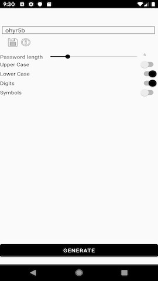
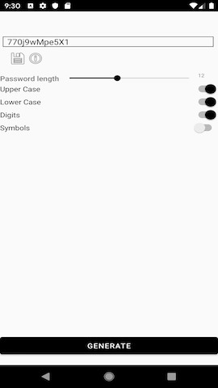

# PassTool

Simple password generator for Android. Generates passwords of a given length using lowercase, uppercase letters, characters and numbers. It can save the generated passwords to the clipboard and evaluate their strength.

[Google Play](https://play.google.com/store/apps/details?id=com.sizeofanton.passgentemp)

